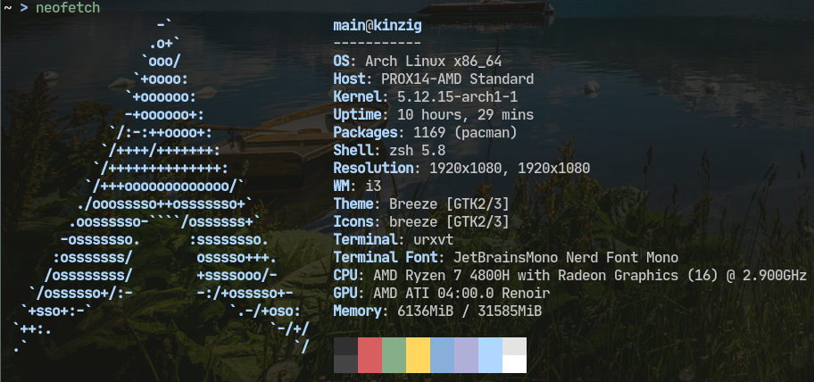

# dotfiles

This is my system configuration. It is based on Arch Linux, i3, tmux, zsh and nvim.

## Installation

Use the `install.sh` script to setup the configuration on your system. **But just do it, if you know what you are doing.** If you just want to have some inspiration for your own configuration, just download single files or copy some lines.
